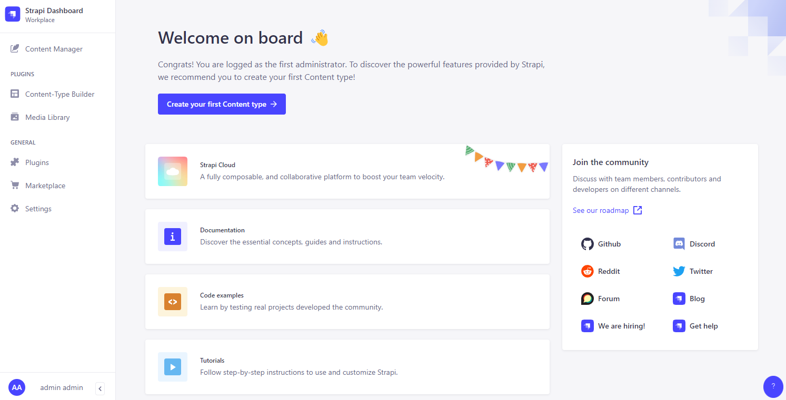

# Strapi CI/CD pipeline

<a href="https://dash.elest.io/deploy?source=cicd&social=dockerCompose&url=https://github.com/elestio-examples/strapi"></a>

Deploy Strapi with CI/CD on Elestio


<br/>
<br/>

# Once deployed ...

You can open Strapi UI here:

    URL: https://[CI_CD_DOMAIN]/admin
    email: [ADMIN_EMAIL]
    password: [ADMIN_PASSWORD]

You can open the pgAdmin web UI here:

    URL: https://[CI_CD_DOMAIN]:8443
    email: [ADMIN_EMAIL]
    password: [ADMIN_PASSWORD]

# Plugins

You can install your plugins by adding the `yarn command` in the `entrypoint.sh` file.

for example:

**_step1:_** Go to the Tools tab, click on the VS Code button, copy the password, click on the Access link, then paste the password

**_step2:_** Go to the entrypoint.sh, and paste your `yarn command` ⚠️One command per line⚠️ and at the end of the file add `yarn build`

**_step3:_** Check to see if the file webpack.config.example.js is in the ./src/admin folder. If it isn't there, create the file `webpack.config.example.js` inside the `/src/admin` folder and add the code below.

```
'use strict';

/* eslint-disable no-unused-vars */
module.exports = (config, webpack) => {
  // Note: we provide webpack above so you should not `require` it
  // Perform customizations to webpack config
  // Important: return the modified config
  return config;
};
```

**_step4:_** Go back to Elestio Dashboard, Details tab, and click to Restart Stack

# Production

By default, you deploy a development version.
You can easily switch between a production version or a development version like this:

**_step1:_** Update the env var to indicate which version you want.
Open Elestio dashboard > Service overview > click on UPDATE CONFIG button > ENV tab
update the variable `NODE_ENV` from `development` to `production` or revert

**_step2:_** click on Update & Restart button.
